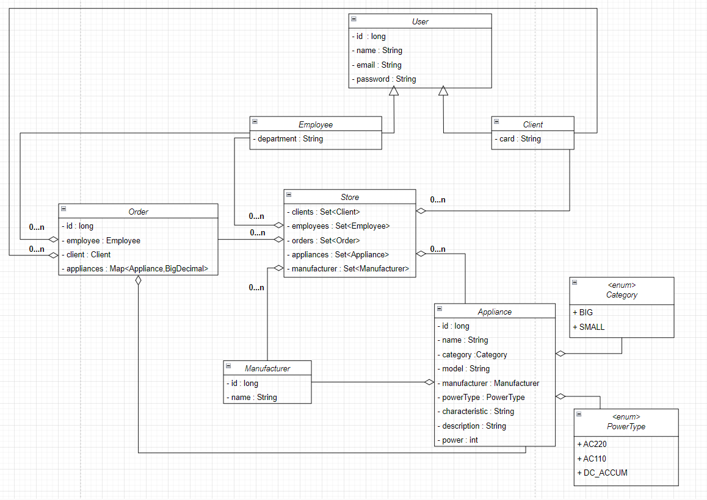

# Appliances shop. Collections

The purpose of this exercise is to check your knowledge of the Java Collections Framework and your ability to use it on practical tasks. 

Duration: **1** hour


## Description

In this exercise, you will implement "Appliances shop" to allow users to filter and sort the Entities in a variety of ways. 
The class diagram of the Domain model is shown in the figure below:



You are also given a description of the following interfaces and class:  
* The `Sort` interface allows to sort different entities.  
* The `Find` interface allows to find different entities.  
* The `Add` interface allows to add different entities.  
* The `Shop` class determines the functionality of the appliances shop. Implements interfaces Add, Find and Sort.  


First, proceed to the Domain model classes and implement their content.  

Then, proceed to the `Shop` class, which contains sets of the `Client`, the `Appliance`, the `Employee`, the `Manufacturer`,  the `Order` classes, and also implements the Add, Sort, Find interfaces. You need to implement the following methods of the Shop class:

* `public void addClient(Client client)`  
Adds a client to the set of clients

* `public void addEmployee(Employee employee)`  
  Adds a employee to the set of employees

* `public void addAppliance(Appliance appliance)`  
  Adds a appliances to the set of appliances

* `public void addOrder(Order order)`  
Adds an order to the set of orders

* `public void addManufacturer(Manufacturer manufacturer)`  
  Adds a manufacturer to the set of manufacturers

* `Manufacturer findManufacturerById(long id)`  
Returns a manufacturer by id. If a manufacturer was not found you have to throw `RuntimeException` with text, for example `Manufacturer with id=25 was not found`. 25 is example a manufacturer id. In a Exception message it may be other.

* `Manufacturer findManufacturerByName(String name)`  
Returns a manufacturer by name. If a manufacturer was not found you have to throw `RuntimeException` with text, for example `Manufacturer with mane=Brand was not found`. The Brand is example a manufacturer brand. In a Exception message it may be other.
 
* `List<Order> findOrderByEmployee(Employee employee)`  
Returns a list of orders by employee. The orders can contain the orders when employee is null. It means the method returns list of orders with employee is null. If the orders not contain orders with current employee then the method returns empty list.

* `Order findCheapestOrder();`  
  Returns a cheaper order from the orders. When we have empty list of orders then you have to throw `RuntimeException` with text `Order not found`.

* `Order findMostExpensiveOrder();`  
  Returns a expensive order from the orders. When we have empty list of orders then you have to throw `RuntimeException` with text `Order not found`.

* `Set<Manufacturer> sortManufacturersByName()`
  Returns a set of manufacturers with natural order by name. All manufacturers with a name equal null can be in bottom of list.

* `Set<Order> sortOrderByClientId()`
  Returns a set of clients with natural order by id.

* `Set<Appliance> sortAppliancesByCategory()`
  Returns a set of appliances with natural order by Category.

* `Set<Order> sortOrderByAmount()`
  Returns a set of orders with natural order by amount(sum) appliances in the order.

### Advice
  The methods may be using in other methods

### Details

* Domain model classes must have the following:
     * A default constructor
     * A constructor that takes values to initialize all fields as parameters
    * Getters and setters for all fields
    * The `equals()`, `hashCode()`, and `toString()` methods 

> Note: In the future, it is expected that objects of these classes will be transferred over a network or stored in a file or database.  

* The string representation of an object of these classes must follow the following convention:
```java
Class_name{field1_name=field_value, field2_name=field_value,...}
```
* If a class inherits another class, it must include inherited fields before its own fields:  
```java
Class_name{parent_class_fields, own_fields}
```
* String values must be surrounded by apostrophes. For example: `text='value'` 
* If a field is a collection or an array, its value must be surrounded by square brackets.
* Fields must be ordered as denoted in the UML class diagram.

## An example of a string representation  

Let class A have the following description:  
```
class A {
    private int p = 10;
    protected int a = 1;
    protected String s = "a string";
    // ...
}
``` 
The string representation of the object will be as follows:  

```
A{p=10, a=1, s='a string'}
```

Let class B be the inheritor of class A and have the following description:
```
class B extends A {
    private int b = 5;
    private String t = "a text";
    private char[] chars = {'a', 'b'};
    // ...
}
```
The string representation of the object will be as follows:
```
B{a=1, s='a string', b=5, t='a text', chars=[a, b]}
```
### Restrictions
You may not use lambda expressions or streams.

