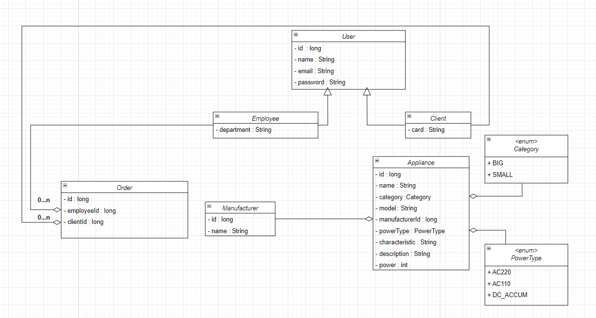

# Appliance shop. IO

The purpose of this exercise is to check your understanding of the Java input/output API.

Duration: **2** hours

## Description

In this exercise, you will implement "Appliance shop" with support for storing and reading/writing entities from/to csv files and storing date in those files. 
The class diagram of the Domain model is shown in the figure below:



You are also given a description of the following interfaces and classes:  
  * The `CsvStorage` interface provides two methods for reading/writing data from/to a csv file.  

  * The `Mapper` class provides static methods for converting text to an object of each entity class and vice versa.  

  * The `CsvStorageImpl` class implements the `CsvStorage` interface.  

First, proceed to the Domain model classes and implement their content.  
Then, proceed to the `CsvStorageImpl` class and implement its content:  

* `public CsvStorageImpl()`  
The constructor that initializes the configuration properties of a csv file with the received values  

* `public CsvStorageImpl(Map<String, String> props)`  
The constructor that initializes the configuration properties of a csv file with the received values

* `<T> List<T> read(InputStream source, Function<String[], T> mapper) throws IOException`  
Returns the contents of the received file as a list of objects. The operation algorithm is as follows: It reads lines with data descriptions through the received source stream. Then, it splits each string into an array of `String` elements using `valuesDelimiter`. Then, it converts the resulting array into an object of the `T` type using the mapper parameter, a function that creates an object of the `T` type with field values taken from the given array.  

* `<T> void write(OutputStream dest, List<T> value, Function<T, String[]> mapper) throws IOException`  
Writes the obtained list of objects to the specified dest stream. The operation algorithm is as follows: Each object of the `T` type is converted into an array of the String type using the mapper parameter. The elements of the array are then collected into a single string using `valuesDelimiter` to separate them. Then, the resulting string is written to a file. The mapper parameter is a function that converts an object of the `T` type into an array of the `String` type.  

### Details
* Domain model classes must have the following:
  -	A default constructor
  -	A constructor that takes values to initialize all fields as parameters
  -	Getters and setters for all fields
  -	The `equals()`, `hashCode()`, and `toString()` methods 

> _Note_: In the future, it is expected that objects of these classes will be transferred over a network or stored in a file or database.  

* The string representation of an object of these classes must follow the following convention:
    ``` 
    Class_name{field1_name=field_value, field2_name=field_value, …}
    ```
     -	If a class inherits another class, it must include inherited fields before its own fields:  
        ```
         Class_name{parent_class_fields,   own_fields}
        ```
    -	String values must be surrounded by apostrophes. For example: text='value'  
    -	If a field is a collection or an array, its value must be surrounded by square brackets.
    -	Fields must be ordered as denoted in the UML class diagram.  
* The configuration properties stored in the `CsvStorageImpl ` class are as follows:
  -	`String encoding`  
The encoding used when reading the csv files must be a valid charset. The default value is "UTF-8"
  -	`String quoteCharacter`  
The quote character is used for string data. The default value is '"'
  -	`String valuesDelimiter`  
The column delimiter character is used when reading a csv file. The default value is ","
  -	`boolean headerLine`  
If true, the first line is considered a header and must be ignored. The default value is "true"
* Converting string data to object field values has the following features:
  -	Empty string must be converted to `null` for referenced types or to the default value for primitive types.  
  -	A quoted empty string "" must be converted to an empty string. It is guaranteed that quoted strings will not contain the _quoteCharacter_ character.  
  -	A string representation of a value must be quoted if it contains the _valuesDelimiter_ character.
  -	A string representation of a date must be in the format "yyyy-mm-dd". It is guaranteed that a date will not contain time-related values.
* Converting object fields to strings has the following features:
  -	A `null` must be converted to an empty string.
  - A `0` must be converted to a `null`.
  -	An empty string must be converted to a quoted empty string "".
* The `write()` method of the `CsvStorageImp` class never writes column headers.

## An example of a string representation


Let class A have the following description:
```
class A {
    private int p = 10;
    protected int a = 1;
    protected String s = "a string";
    // ...
}
```
The string representation of the object will be as follows:
```
A{p=10, a=1, s='a string'}
```
Let class B be the inheritor of class A and have the following description:
```
class B extends A {
    private int b = 5;
    private String t = "a text";
    private char[] chars = {'a', 'b'};
    // ...
}
```
The string representation of the object will be as follows:
```
B{a=1, s='a string', b=5, t='a text', chars=[a, b]}
```
### Restrictions


You may not use lambda expressions or streams.

