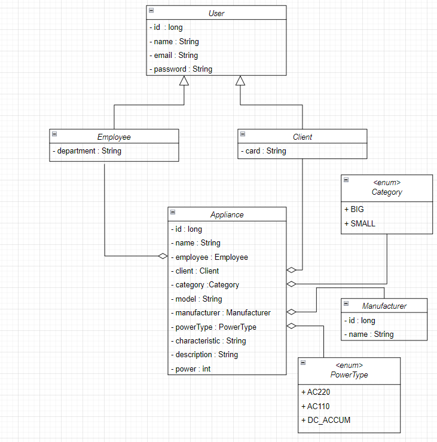

# Appliances store. OOP

The purpose of this exercise is to check your understanding of object-oriented programming and its implementation in the Java language.

Duration: **30** minutes

## Description

In this exercise, you will implement an entity class hierarchy to represent data an appliances store. The class diagram of the Domain model is shown in the figure below:


## Details

These classes must have the following:
  * The fields with correct access level
  * The classes with public access level
  * The constructors with public access level
  * A default constructor
  * A constructor that takes values to initialize all fields as parameters
_Note_: In the future, it's expected that objects of these classes will be transferred over a network or stored in a file or database.

A string representation of an object of these classes must follow the following convention: 
```
Class_name{field1_name=field_value, field2_name=field_value, …}
```
- If a class inherits another class, it must include inherited fields before its own fields: 
```
Class_name{parent_class_fields, own_fields}
```
- •	String values must be surrounded by apostrophes. For example: `text='value'`
- If a field is a collection or an array, its value must be surrounded by square brackets.
- Fields must be ordered as denoted in the UML class diagram.

### An example of a string representation:
Let class `A` have the following definition:
```
class A {
    private int p = 10;
    protected int a = 1;
    protected String s = "a string";
    // ...
}
```
The string representation of the object will be as follows:
```
A{p=10, a=1, s='a string'}
```
Let class `B` be the inheritor of class A and have the following definition:
```
class B extends A {
    private int b = 5;
    private String t = "a text";
    private char[] chars = {'a', 'b'};
    // ...
}
```
The string representation of the object will be as follows:
```
B{a=1, s='a string', b=5, t='a text', chars=[a, b]}
```
